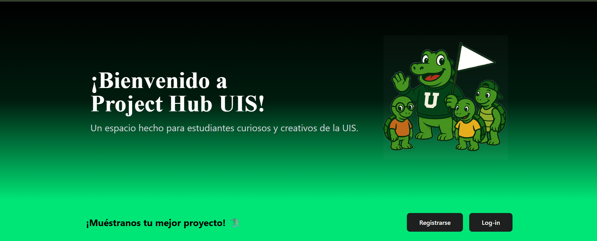
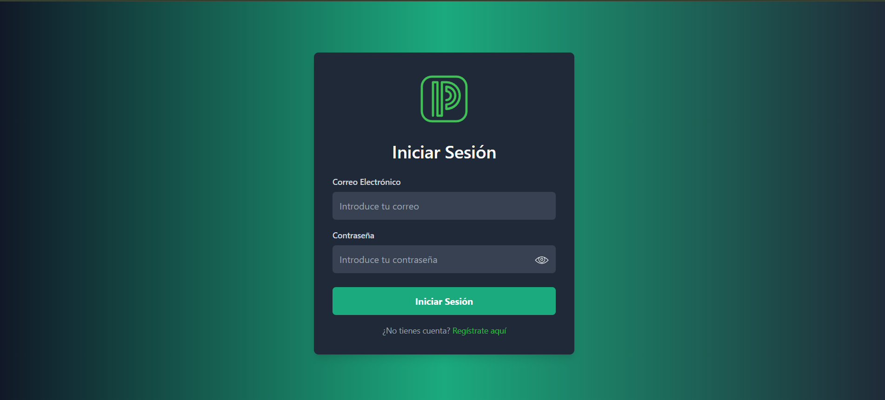
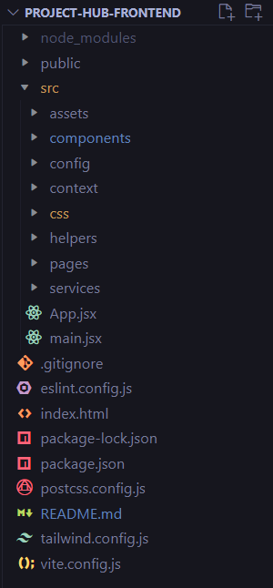

# 📚 Project-Hub

Project-Hub es una plataforma web diseñada para estudiantes universitarios que permite organizar grupos de trabajo, gestionar proyectos e integrantes, y personalizar perfiles de usuario. La aplicación facilita la colaboración académica y mejora la comunicación dentro de la comunidad universitaria UIS.

---

## 📌 Características

- 👤 Perfiles de usuario editables.
- 👥 Gestión de grupos de trabajo universitarios.
- 📁 Administración de proyectos por grupo.
- 🔐 Sistema de autenticación.
- 🛠️ Seguridad y encriptación de los datos sensibles.

---

## 🚀 Tecnologías utilizadas

- **Frontend:** React.js, TailwindCSS,
- **Backend:** Java /Springboot
- **Base de datos:** MySQL
- **Control de versiones:** Git y GitHub

---

## 📸 Capturas de pantalla

### 🧾 Página Principal



### 📊 Grupos



### 👥 Perfil de usuario


### 🧾 Login


### 📊 Edición de grupos


### 👤 Creación de grupos


---

## 🧪 Cómo ejecutar el proyecto
1. Clona este repositorio:

```bash
git clone https://github.com/AdrianCCRS/project-hub-frontend.git
```

Desde la teminal ubicados en la carpeta del proyecto ejecutar los siguientes comandos.


- npm install
- npm run dev

Posteriormente si desean ejecutar el proyecto completo pueden descargar el backend en el siguiente enlace y ejecutar su backend en  Springboot.

[Backend](https://github.com/SebastianBadillo/Entornos)

## 👥 Integrantes

- Yeison Adrián Caceres Torres [Github](https://github.com/AdrianCCRS)
- Daniel Sebastián Badillo Neira [Github](https://github.com/SebastianBadillo)
- José Alejandro Gómez Vargas [Github](https://github.com/Alejandrogv2304)

## 👥 Estructura del proyecto


